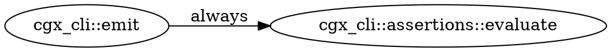
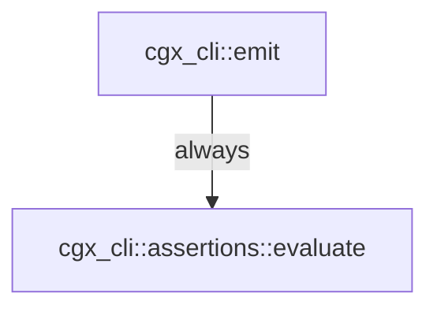

# cgx — Output Formats and Exit Codes

**Audience:** Engineers and AI agents running cgx in interactive or CI contexts.
**Since:** All content v0.1 unless tagged otherwise.

Run `cgx --version` before using this reference. A feature tagged `Since: v0.N` requires `MINOR ≥ N`
in the reported version. For the full version ladder, see `reference/versions.md`.
For flag syntax and subcommand signatures, see `reference/cli.md`.

---

## 1. Output formats (`--format`)

Every subcommand accepts `--format <FMT>`. The default is `human`.

| Format | Since | Best for |
|--------|-------|----------|
| `human` | v0.1 | Reading at a terminal. `callers`/`callees`/`flows-to`/`flows-from`/`reaches <from>` render an ASCII call **forest** (see §1.1); `paths`/`unused` render a list. File:line evidence and edge/confidence tags inline. |
| `json` | v0.1 | Scripting, agents, CI pipelines. Structured envelope with `results[]`, `count`, `vacuous`, and — on the eight subcommands that carry it — the `approximation` contract (§1.2). |
| `sarif` | v0.1 | Security tooling. SARIF 2.1.0 — uploads to GitHub Advanced Security, VS Code SARIF viewer, and any OASIS-compliant tool. |
| `dot` | v0.1 | Path-shaped results only. Feeds `dot -Tsvg` or any Graphviz consumer for SVG/PNG artifacts. Use for large graphs (Mermaid has a node limit). |
| `mermaid` | v0.1 | Path-shaped results only. Renders inline in GitHub Markdown, Notion, and most docs platforms. Human-writeable and diff-friendly. |
| `d2` | v0.1 | Path-shaped results only. Feeds the D2 diagramming tool or https://play.d2lang.com. |

**Path-shaped restriction:** `dot`, `mermaid`, and `d2` are only valid for output that describes a
graph path — the `paths` and `reaches <from> <to>` subcommands, or a `cgx query` that uses `RETURN path`.
Applying them to any other command (e.g., `callers`, `callees`, `unused`) exits `2`. Three
different messages carry that rejection, depending on which command you asked:

```
Dot format is only valid for path-returning results (`paths`, `reaches <from> <to>`, or a CQL `RETURN path` query)
dot/mermaid/d2 are only valid for path-returning queries (RETURN path); this query returns a table — use --format human|json|sarif
Dot format is not supported by `search` — use --format human|json
```

The first is the shared result-emitting path (`callers`/`callees`/`unused`/`reaches <from>`);
the second is a tabular `cgx query`; the third is `search`/`symbols`, which reject the format
themselves. The format name at the front varies (`Dot`, `Mermaid`, `D2`). Match on the exit
code, not the wording. The flag is accepted in the help text but rejected at runtime for
non-path commands.

### 1.1 The human call forest (`callers` / `callees` / `flows-to` / `flows-from` / `reaches <from>`)

The default human view of the neighbor-set commands is an ASCII forest: the
queried symbol is the bare root line and the symbols it calls (or that call it)
hang off `├─ │ └─` box-drawing prefixes. Depth is shown by indentation — there is
no `depth=` field.

Each child line is `fqn  file:line`, then non-default tags only:

- condition: `[if]` (conditional), `[exc]` (exception), `loop`/`panic` verbatim;
  `always` is omitted.
- confidence: `[probable]`, `[possible]`; `certain` is omitted.

`--tree <full|spanning>` (default `full`). Both modes bound the walk to depth 2
when `--depth` is unset (an explicit `--depth` overrides), and a
work-budget cap prints `… (truncated: N more)` at the cut:

- **full** — expand every call edge; a symbol reached from two callers appears
  under each. Revisiting an ancestor on the current branch prints
  `↺ name (cycle)` and stops descending.
- **spanning** — render each symbol once under its shortest-path parent, annotated
  `(+N call sites)` when more than one call site within the bounded neighborhood
  reaches it.

```
cgx_core::confidence::Confidence::weakest  crates/cgx-core/src/confidence.rs:40
├─ cgx_query::engine::build_path_result::{closure@220:14}  …/engine.rs:220  [if]  [probable]
│  ├─ ts_sample::closures::closureVariable  …/closures.ts:6  [possible]  (+1 call sites)
│  ├─ ts_sample::closures::nestedClosures  …/closures.ts:57  [possible]  (+1 call sites)
│  └─ ts_sample::closures::nestedClosures::outer  …/closures.ts:58  [possible]  (+1 call sites)
└─ cgx_query::engine::weakest_confidence_to  …/engine.rs:93  [loop]  [probable]
   └─ cgx_query::engine::neighbor_walk  …/engine.rs:51
```

`reaches <from> <to>` (with a target) answers a single reachability question and
keeps its **witness-path** rendering — it is not a forest.

**When to choose which format:**

- Human at a terminal → `human` (default, no flag needed).
- Agent or script consuming results programmatically → `json`.
- CI security gate with GitHub Actions SARIF upload → `sarif`.
- Generating a diagram artifact in CI or embedding in docs → `dot` (CI) or `mermaid` (docs).
- Interactive diagram editing with D2 → `d2`.

### 1.2 The approximation contract — which answers carry it

*Shipped on `main`, ahead of the `0.3.0` version string — `cgx --version` cannot tell you whether
your binary emits it. Check by running `cgx callers <sym>` and looking for the trailing
`approximation:` line — probe it on a subcommand that has one, per the list below.*

The contract rides on the eight subcommands whose results are rendered through the shared
result-emitting path: **`callers`, `callees`, `reaches`, `paths`, `flows-to`, `flows-from`,
`unused`, `query`**. Each of those states **which direction it can be wrong**, so a consumer
never has to guess whether an empty result means "proven absent" or "we stopped looking".

**`index`, `explain`, `search`, `symbols`, `doctor`, and `diff` render directly and carry no
contract** — on any version. Two consequences worth internalising:

- A probe for the `approximation:` line against `cgx search` or `cgx symbols` reports a current
  binary as an old one.
- **`cgx diff --path-added` is the sharp edge.** Its clean exit *is* a negative-completeness
  claim — "no new call/dataflow path from `--from` to `--to`" — and it is exactly the command
  that carries no `approximation` and no `scope`. When you gate a PR on it, the scope of the
  search is not stated in the output; you have to know it from the flags you passed.

- **human** — one compact trailing line:
  `approximation: <exact (within modeled graph)|over-approximate|under-approximate|over- and under-approximate>`,
  then ` — <reasons joined by ; >` when there are any, then ` | scope: <edge kinds>, confidence>=<tier>, depth<=<N>`
  on a negative/absence answer.
- **json** — two extra top-level keys alongside `count`/`results`: `"vacuous": <bool>` and an
  `"approximation"` object with `direction` (`exact`/`over`/`under`/`over_under`), `reasons[]`
  (each `{direction, code, detail}` — `code` is a stable kebab-case token to match on in CI),
  `modeled_graph` (the standing carve-out: external/unindexed callees, undescended closure bodies,
  and unexpanded macros are outside the modeled graph), and, on a negative answer only, `scope`
  (`searched_edge_kinds`, `confidence_floor`, `max_depth`).
- **sarif** — an extra result under `ruleId: "cgx/approximation-contract"`.
- **dot / mermaid / d2** — nothing; these emit raw graph source and carry no prose.

`exact` is always relative to `modeled_graph`. It never means "proven for the whole program".

### Real output samples

The following samples show the **shape** of `cgx reaches cgx_cli::emit
cgx_cli::assertions::evaluate`. The `approximation` values are per-answer and will differ for your
query — read them, do not assume them.

**human:**
```
path 1 (1 hops, min-confidence=probable):
     cgx_cli::emit  (crates/cgx-cli/src/main.rs:989)
  -> cgx_cli::assertions::evaluate  (crates/cgx-cli/src/assertions.rs:57) [always]
approximation: over-approximate — <one reason phrase per contributing reason>
```

**json:**
```json
{
  "results": [{"condition": "always", "confidence": "certain", "depth": 1}],
  "count": 1,
  "vacuous": false,
  "approximation": {
    "direction": "over",
    "reasons": [{"direction": "over", "code": "<stable-kebab-token>", "detail": "<phrase>"}],
    "modeled_graph": "descended function bodies in the indexed repository; external/unindexed callees, undescended closure bodies, and unexpanded macros are outside the modeled graph"
  },
  "truncated": false,
  "truncation_reason": null
}
```

The `truncated`/`truncation_reason` pair appears on path-shaped results only. A negative answer
additionally carries `approximation.scope`.

**dot:**


**mermaid:**


**d2:**
```d2
n0: "cgx_cli::emit"
n1: "cgx_cli::assertions::evaluate"
n0 -> n1: "always"
```

**sarif:** SARIF 2.1.0 JSON with a `runs[].results[]` array. Each result maps to a `physicalLocation`
(file:line) and `logicalLocation` (qualified symbol name). Exit code 1 when `--assert-empty` fires
makes SARIF upload and build failure composable in the same step.

---

## 2. Exit-code contract

| Code | Meaning | How to trigger |
|------|---------|----------------|
| `0` | Success — query ran; results returned (including zero results) | Normal query against an indexed repo |
| `1` | Assert failure — `--assert-empty` fired because results were found | `cgx callers foo --assert-empty` when `foo` has callers |
| `2` | Usage error — unresolved symbol, CQL parse or plan error, bad argument | `cgx callers nonexistent_xyz`; unsupported CQL property; phantom flag |
| `3` | Graph error — the index is missing, corrupt, or could not be built | `cgx callers foo --no-auto-index` with no `.cgx/` present; also a corrupt `.cgx/index.db` or a failed index build, regardless of `--no-auto-index` |
| `4` | Vacuous pass — `--assert-empty` would exit 0, but either the pattern matched zero nodes or the active filters excluded every result the unfiltered query would have returned | `cgx callers nonexistent_xyz --assert-empty`; `cgx paths A B --confidence certain --assert-empty` when only `possible` paths exist |

**Key insight — exit 0 includes empty results.** A query that finds nothing is not an error. Empty
results exit `0`. Only assertion flags (`--assert-empty`) change that. Exit `2` means the command
itself was malformed (bad symbol name, bad CQL, bad flag) — not that results were absent.

**Auto-index is on by default.** A missing `.cgx/` triggers an automatic build, which is why exit
`3` is most often seen with `--no-auto-index`. It is not exclusive to that flag: a corrupt store or
a build that fails also exits `3`.

**Exit 2 disambiguation.** All of these produce exit 2:
- Unknown or mistyped symbol name: `no symbol matched pattern '<x>'`
- CQL parse error (e.g., single-quoted string, `NOT IN [...]`, node-only MATCH with no relationship)
- CQL plan error — `MATCH ALL … MUST PASS THROUGH`/`AVOIDING`, intercepted by name and reported as `(deferred)`; unsupported **node** property (`entrypoint_class`, `source_class`, `sink_class`, `sanitizer_class`) reported as `(no backing field on a symbol node)`; unsupported **edge** property (`via`, `taint_label`, `site`) reported as `(no backing field on an edge)`. `taint_label` is an *edge* property, not a node property
- Phantom flag that does not exist (e.g., `--max-depth`, `--base`, `--dataflow`, `--assert-count`, `--assert-max`)

Exit 2 is the signal to check the symbol name (grep source first), the CQL syntax, and the flag
names against `reference/cli.md`. It is never "empty results."

---

## 3. CI assertion mode

### `--assert-empty`

Turns a query into a boolean CI gate. Exit `1` if any results are returned; exit `0` if results are
empty. Output is still written regardless of the assertion outcome — use `--format sarif` to compose
with SARIF upload.

```bash
# Since: v0.1
# Fail CI if any call path from cgx_cli::emit reaches cgx_cli::assertions::evaluate
cgx reaches cgx_cli::emit cgx_cli::assertions::evaluate --assert-empty
```

```bash
# Since: v0.1
# Emit a SARIF report AND fail CI if the path exists
cgx paths FromFn ToFn --assert-empty --format sarif > findings.sarif
```

### Vacuity guard and `--allow-vacuous`

**The problem.** `--assert-empty` can pass vacuously: if the symbol pattern resolves to zero nodes,
no paths are found and the assertion trivially passes — but for the wrong reason. A gate that passes
because the symbol was mistyped (exit `0`) is indistinguishable from a gate that passes because no
paths exist (also exit `0`) without the vacuity guard.

**The guard.** When `--assert-empty` would exit `0`, cgx exits `4` instead ("assertion vacuously
satisfied") if **either** of two clauses fires:

- **(a) zero-symbol match** — the symbol pattern resolved to no nodes. This catches a mistyped
  symbol silently passing a security gate.
- **(b) filters excluded everything** — the *same* query run without its confidence/edge-condition
  filters would have returned results, and the active filters removed all of them. `cgx paths A B
  --confidence certain --assert-empty` exits `4`, not `0`, when a real `possible`-confidence path
  exists between A and B. The gate did not prove absence; it proved your floor was too high.

Clause (b) applies to `callers`, `callees`, `flows-to`, `flows-from`, `paths`, and
`reaches <from>` (the enumerate-all form). It does **not** apply to `reaches <from> <to>`,
to `unused`, or to `query` (which reads no `--confidence` flag at all). Clause (a) applies
everywhere.

**`unused` is the dangerous exemption, and not for the reason you would guess.**
`--confidence` *does* change `unused`'s result: the floor is applied to the reachability
walk, so raising it drops edges, makes fewer symbols reachable, and **inflates** the dead-code
complement. Clause (b) still never fires — `unused` reports its filtered count as its own
unfiltered baseline, so the guard has nothing to compare against. The net effect:

```bash
cgx unused --confidence certain --assert-empty
```

is a gate whose **clause-(b) check never fires** — clause (a) still does, but only on a wholly
empty graph. The exposure is *not* a false pass. Because raising the floor only removes edges,
the filtered unused set is a **superset** of the unfiltered one, so a pass proves the unfiltered
answer is empty too. What you lose is the *warning*: the inflated complement makes the gate fail
**loudly and spuriously** — exit 1 on symbols that are reachable in the honest graph — and nothing
in the output tells you the floor caused it. If you gate on `unused`, drop `--confidence`, or run
the unfiltered query yourself and compare the two counts before believing an exit 1.

```bash
# Since: v0.1
# If 'nonexistent_xyz' is not in the index, this exits 4 (not 0)
cgx callers nonexistent_xyz --assert-empty
```

**Suppressing the guard.** Pass `--allow-vacuous` to treat a vacuous pass as success (exit `0`).
A stderr warning is emitted regardless. Use this only when an empty symbol set is genuinely expected
(e.g., a new codebase with no callers yet).

```bash
# Since: v0.1
cgx callers new_symbol --assert-empty --allow-vacuous
```

### Writing a correct CI gate

A gate that neither fails on regression nor passes vacuously requires two things:

1. The symbol name resolves in the index (exit `2` if not; exit `4` if vacuous).
2. The gate exits `1` on regression and `0` only on genuine absence.

```bash
# Since: v0.1
# Reliable pattern: verify the symbol exists first, then assert
cgx explain FromFn --repo /path/to/repo          # exits 2 if symbol missing
cgx paths FromFn ToFn --assert-empty \
    --format sarif > findings.sarif               # exits 1 on regression, 4 on vacuous pass
```

In CI, treat exit `4` the same as exit `1` (gate failure) — it signals a misconfigured assertion.
Only exit `0` (genuine empty result) is a clean pass.

```yaml
# GitHub Actions example (Since: v0.1)
- name: Security regression gate
  run: |
    cgx paths FromFn ToFn --assert-empty --format sarif > findings.sarif
  # exit 1 → step fails (regression); exit 4 → step fails (vacuous); exit 0 → passes

- name: Upload SARIF
  if: always()
  uses: github/codeql-action/upload-sarif@v3
  with:
    sarif_file: findings.sarif
```

---

## Cross-references

- Flag syntax and per-subcommand flag availability: `reference/cli.md`
- Version ladder and capability `since` tags: `reference/versions.md`
- Edge-condition labels and confidence ladder (needed to interpret result fields): `reference/mental-model.md`
- CQL syntax constraints that produce exit 2: `reference/query-language.md`
