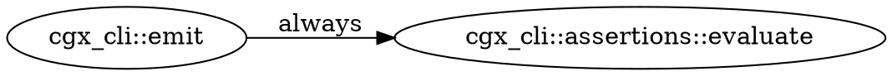
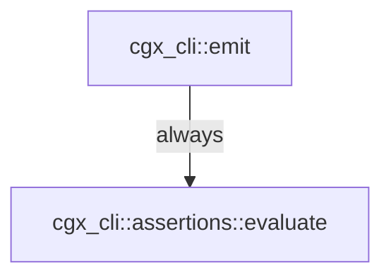

# cgx — Output Formats and Exit Codes

**Audience:** Engineers and AI agents running cgx in interactive or CI contexts.
**Since:** All content v0.1 unless tagged otherwise.

Run `cgx --version` before using this reference. A feature tagged `Since: v0.N` requires `MINOR ≥ N`
in the reported version. For the full version ladder, see `reference/versions.md`.
For flag syntax and subcommand signatures, see `reference/cli.md`.

---

## 1. Output formats (`--format`)

Most subcommands accept `--format <FMT>`; the default is `human`. **No subcommand accepts all
six**, and three different things happen to a format a command does not support — rejection,
a bespoke rejection, or silent fallback. The matrix below was produced by running every
subcommand once per format.

| Format | Since | Best for |
|--------|-------|----------|
| `human` | v0.1 | Reading at a terminal. `callers`/`callees`/`flows-to`/`flows-from`/`reaches <from>` render an ASCII call **forest** (see §1.1); `paths`/`unused` render a list. File:line evidence and edge/confidence tags inline. |
| `json` | v0.1 | Scripting, agents, CI pipelines. Structured envelope with `results[]`, `count`, `vacuous`, the `freshness` envelope (§1.3), and — on the subcommands that carry it — the `approximation` contract (§1.2). |
| `sarif` | v0.1 | Security tooling. SARIF 2.1.0 — uploads to GitHub Advanced Security, VS Code SARIF viewer, and any OASIS-compliant tool. |
| `dot` | v0.1 | Path-shaped results only. Feeds `dot -Tsvg` or any Graphviz consumer for SVG/PNG artifacts. Use for large graphs (Mermaid has a node limit). |
| `mermaid` | v0.1 | Path-shaped results only. Renders inline in GitHub Markdown, Notion, and most docs platforms. Human-writeable and diff-friendly. |
| `d2` | v0.1 | Path-shaped results only. Feeds the D2 diagramming tool or https://play.d2lang.com. |

### Which subcommand accepts which format

`✓` = accepted. `2` = exit 2 with a rejection message. `≈` = **accepted and ignored**: the
command renders its ordinary human text and exits 0.

| Subcommand | human | json | sarif | dot / mermaid / d2 |
|---|---|---|---|---|
| `callers`, `callees`, `flows-to`, `flows-from`, `reaches <from>`, `unused` | ✓ | ✓ | ✓ | 2 |
| `paths`, `reaches <from> <to>` | ✓ | ✓ | ✓ | ✓ |
| `query` (table result) | ✓ | ✓ | ✓ | 2 |
| `query` (`RETURN path`) | ✓ | ✓ | ✓ | ✓ |
| `search`, `symbols` | ✓ | ✓ | 2 | 2 |
| `coupling` | ✓ | ✓ | 2 | 2 |
| `diff` | ✓ | ✓ | 2 | 2 |
| `diff --path-added` | ✓ | ✓ | 2 | ✓ |
| `explain`, `doctor` | ✓ | ✓ | ≈ | ≈ |

**Path-shaped restriction:** `dot`, `mermaid`, and `d2` describe a graph path, so they are only
meaningful for `paths`, `reaches <from> <to>`, a `cgx query` that uses `RETURN path`, and
`diff --path-added`. Four *different* messages carry the rejection elsewhere:

```
Dot format is only valid for path-returning results (`paths`, `reaches <from> <to>`, or a CQL `RETURN path` query)
dot/mermaid/d2 are only valid for path-returning queries (RETURN path); this query returns a table — use --format human|json|sarif
Dot format is not supported by `search` — use --format human|json
dot format is not supported by `cgx diff` — use --format human|json
```

The first is the shared result-emitting path (`callers`/`callees`/`unused`/`reaches <from>`/
`flows-*`); the second is a tabular `cgx query`; the third is `search`/`symbols`/`coupling`,
which reject the format themselves; the fourth is `diff`. The format name at the front varies in
case and spelling (`Dot`, `Mermaid`, `D2`, `dot`, `sarif`). **Match on the exit code, not the
wording.**

> **The `≈` row is the trap.** `explain` and `doctor` route every non-`json` format to their human
> renderer, so `cgx explain <sym> --format dot` exits **0** and emits output byte-identical to
> `--format human` — no error, no warning, nothing that looks like a graph. A pipeline that feeds
> that to `dot -Tsvg` fails downstream, far from the cause. `sarif` behaves the same way on those
> two. Ask for `human` or `json` from `explain` and `doctor`, and nothing else.

`--format` is listed in `--help` for formats that are rejected at runtime; the help text is not
the accept-list.

### 1.1 The human call forest (`callers` / `callees` / `flows-to` / `flows-from` / `reaches <from>`)

The default human view of the neighbor-set commands is an ASCII forest: the
queried symbol is the bare root line and the symbols it calls (or that call it)
hang off `├─ │ └─` box-drawing prefixes. Depth is shown by indentation — there is
no `depth=` field.

Each child line is `fqn  file:line`, then non-default tags only:

- condition: `[if]` (conditional), `[exc]` (exception), `loop`/`panic` verbatim — though `panic` never appears, the label being schema-only (`reference/mental-model.md` §3);
  `always` is omitted.
- confidence: `[probable]`, `[possible]`; `certain` is omitted.

`--tree <full|spanning>` (default `full`). Both modes bound the walk to depth 2
when `--depth` is unset (an explicit `--depth` overrides), and a
work-budget cap prints `… (truncated: N more)` at the cut:

- **full** — expand every call edge; a symbol reached from two callers appears
  under each. Revisiting an ancestor on the current branch prints
  `↺ name (cycle)` and stops descending.
- **spanning** — render each symbol once under its shortest-path parent, annotated
  `(+N call sites)` when more than one call site within the bounded neighborhood
  reaches it.

A real `cgx callers cgx_core::confidence::Confidence::weakest` against an index of cgx's own
`crates/` plus `fixtures/` — the default `--tree full`, no `--depth`, run twice and
byte-identical. Note the two trailing envelope lines: they are part of every answer from this
command, not an artifact of the example.

```
cgx_core::confidence::Confidence::weakest  crates/cgx-core/src/confidence.rs:40
├─ cgx_query::engine::build_path_result::{closure@220:14}  crates/cgx-query/src/engine.rs:220  [if]  [probable]
│  ├─ ts_sample::closures::closureVariable  fixtures/ts-sample/src/closures.ts:6  [possible]
│  ├─ ts_sample::closures::nestedClosures  fixtures/ts-sample/src/closures.ts:57  [possible]
│  └─ ts_sample::closures::nestedClosures::outer  fixtures/ts-sample/src/closures.ts:58  [possible]
└─ cgx_query::engine::weakest_confidence_to  crates/cgx-query/src/engine.rs:93  [loop]  [probable]
   └─ cgx_query::engine::neighbor_walk  crates/cgx-query/src/engine.rs:51
approximation: over- and under-approximate — resolved through an over-approximated candidate set (dynamic dispatch or name-collision); some reported edges may not occur; external/unindexed callees not modeled (no SCIP) (6 site(s) on the searched frontier); search stopped at depth 2; deeper edges were not explored
freshness: current | indexed tree d17e756, working tree clean
```

Read the contract before the tree: the three TypeScript children are `possible` edges from an
over-approximated candidate set — a cross-language name collision, not evidence that TS code
calls a Rust method — and the walk stopped at depth 2.

The `(+N call sites)` annotation appears only under `--tree spanning`, which is why it is absent
above.

`reaches <from> <to>` (with a target) answers a single reachability question and
keeps its **witness-path** rendering — it is not a forest.

**When to choose which format:**

- Human at a terminal → `human` (default, no flag needed).
- Agent or script consuming results programmatically → `json`.
- CI security gate with GitHub Actions SARIF upload → `sarif`.
- Generating a diagram artifact in CI or embedding in docs → `dot` (CI) or `mermaid` (docs).
- Interactive diagram editing with D2 → `d2`.

### 1.2 The approximation contract — which answers carry it

*Shipped on `main`, ahead of the `0.3.0` version string — `cgx --version` cannot tell you whether
your binary emits it. Check by running `cgx callers <sym>` and looking for the trailing
`approximation:` line — probe it on a subcommand that has one, per the list below.*

The contract rides on the eight subcommands whose results are rendered through the shared
result-emitting path — **`callers`, `callees`, `reaches`, `paths`, `flows-to`, `flows-from`,
`unused`, `query`** — and on **`coupling`**, which carries it as a field of its own report
rather than through the shared path. Each of those states **which direction it can be wrong**, so
a consumer never has to guess whether an empty result means "proven absent" or "we stopped
looking".

**`index`, `explain`, `search`, `symbols`, `doctor`, and `diff` render directly and carry no
contract** — on any version. A missing contract is not a claim of exactness; it is silence on the
question. Two consequences worth internalising:

- A probe for the `approximation:` line against `cgx search` or `cgx symbols` reports a current
  binary as an old one.
- **`cgx diff --path-added` is the sharp edge.** Its clean exit *is* a negative-completeness
  claim — "no new call/dataflow path from `--from` to `--to`" — and it is exactly the command
  that carries no `approximation` and no `scope`. When you gate a PR on it, the scope of the
  search is not stated in the output; you have to know it from the flags you passed.

- **human** — one compact trailing line:
  `approximation: <exact (within modeled graph)|over-approximate|under-approximate|over- and under-approximate>`,
  then ` — <reasons joined by ; >` when there are any, then ` | scope: <edge kinds>, confidence>=<tier>, depth<=<N>`
  when the answer carries a scope (below).
- **json** — two extra top-level keys alongside `count`/`results`: `"vacuous": <bool>` and an
  `"approximation"` object with `direction` (`exact`/`over`/`under`/`over_under`), `reasons[]`
  (each `{direction, code, detail}` — `code` is a stable kebab-case token to match on in CI),
  `modeled_graph` (the standing carve-out: external/unindexed callees, undescended closure bodies,
  and unexpanded macros are outside the modeled graph), and `scope`
  (`searched_edge_kinds`, `confidence_floor`, `max_depth`) when the answer carries one.
- **sarif** — an extra result under `ruleId: "cgx/approximation-contract"`.
- **dot / mermaid / d2** — nothing; these emit raw graph source and carry no prose.

`exact` is always relative to `modeled_graph`. It never means "proven for the whole program".

#### When `scope` is present — the rule is "is this an absence claim?", not "is the list empty?"

`scope` states what was actually searched, so it rides on any answer that **asserts an absence**.
For most commands that is the same thing as an empty result, which is why "empty answers only" is a
tempting shortcut — and why it is wrong exactly once.

| Answer | `scope` attached when |
|---|---|
| `callers`, `callees`, `reaches <from>`, `flows-to`, `flows-from` | the result list is empty |
| `paths <from> <to>` | no path was found |
| `reaches <from> <to>` | there is no witness (`reachable == false`) |
| **`unused`** | **always** |
| `query` — table or `RETURN path` | never |
| `coupling` | never |

**`unused` is the case that separates the two rules.** Every `unused` answer is an absence claim —
"these symbols are not reached from any entrypoint" — so its contract builder attaches the scope
unconditionally, with no emptiness guard. Verified live on the **self-index corpus**
(`reference/mental-model.md` §2.2): an answer with **15,649** results carries
`scope` (`confidence_floor: "possible"`, `max_depth: null`, the six call-edge kinds), while a
`callers` answer with 7 results carries none.

A client that keys on "results is empty" therefore mis-parses **every non-empty `unused` answer**.
Key on the presence of the field, not on the count.

`coupling` and `query` never carry a scope for the same underlying reason from opposite directions:
`scope`'s fields are call-graph concepts, and a history answer models no call edges at all, while a
CQL query carries its scope intrinsically in its own text.

**`coupling` never reports `exact`.** Two of its reasons — `file-level-granularity` (over) and
`bounded-rev-range` (under) — fire unconditionally, so its `direction` is permanently
`over_under`. That is a property of what co-change can mean, not a defect in a particular answer.

### 1.3 The freshness envelope — what the answer was computed over

Separate from the contract, and carried by a **different** set of commands. `approximation`
answers "which direction can this be wrong"; `freshness` answers "how far is the graph this was
computed over from your working tree".

Every command that reads the index carries it: the eight contract-carrying subcommands **plus**
`explain`, `search`, and `symbols`. `index`, `doctor`, `diff`, and `coupling` carry none —
`coupling` because it answers from committed git history and never opens the index, so an
index-freshness envelope would describe a store the answer never read.

The two footers are therefore independent, and no command emits a fixed two-line block:

| Subcommand | `approximation:` | `freshness:` |
|---|---|---|
| `callers`, `callees`, `reaches`, `paths`, `flows-to`, `flows-from`, `unused`, `query` | ✓ | ✓ |
| `explain`, `search`, `symbols` | — | ✓ |
| `coupling` | ✓ | — |
| `index`, `doctor`, `diff` | — | — |

- **human** — one trailing line:
  `freshness: <current|stale|unknown> | indexed tree <oid>` plus only the qualifiers that apply —
  ` (behind HEAD <oid>)` or ` (HEAD unknown)`, then `, working tree clean` / `, N dirty file(s)` /
  `, working tree not inspected`.
- **json** — a top-level `freshness` object: `indexed_tree`, `head_tree`, `matches_head`,
  `dirty_files_base`, `dirty_files`, `stale`.
- **sarif** — an extra result alongside the contract's.
- **dot / mermaid / d2** — nothing; the envelope is skipped entirely for these formats, so
  nothing pays for a working-tree walk whose result would be discarded.

**`matches_head` is three-valued** (`true`/`false`/`null`) and `stale` is not its negation: an
index that matches `HEAD` but sits under a dirty working tree is `stale` with `matches_head:
true`. Branch on both. `current` is emitted only when both halves were established *and* both
came back clean.

### Real output samples

Real runs of `cgx reaches cgx_cli::emit cgx_cli::assertions::evaluate` against an index of cgx's
own `crates/` plus `fixtures/`, each run twice and byte-compared. The `approximation` and
`freshness` values are per-answer and per-checkout and will differ for you — read them, do not
assume them.

**human:**
```
path 1 (1 hops, min-confidence=probable):
     cgx_cli::emit  (crates/cgx-cli/src/main.rs:1396)
  -> cgx_cli::assertions::evaluate  (crates/cgx-cli/src/assertions.rs:57) [always]
approximation: exact (within modeled graph)
freshness: current | indexed tree d17e756, working tree clean
```

**json:**
```json
{
  "approximation": {
    "direction": "exact",
    "modeled_graph": "descended function bodies in the indexed repository; external/unindexed callees, undescended closure bodies, and unexpanded macros are outside the modeled graph",
    "reasons": []
  },
  "count": 1,
  "freshness": {
    "dirty_files": 0,
    "dirty_files_base": "d17e7565cc98548ff58fd922aa47007d1b88b2ca",
    "head_tree": "d17e7565cc98548ff58fd922aa47007d1b88b2ca",
    "indexed_tree": "d17e7565cc98548ff58fd922aa47007d1b88b2ca",
    "matches_head": true,
    "stale": false
  },
  "results": [
    {
      "crosses_exceptional": false,
      "hops": 1,
      "min_confidence": "probable",
      "steps": [
        { "file": "crates/cgx-cli/src/main.rs", "fqn": "cgx_cli::emit", "line": 1396 },
        { "condition": "always", "file": "crates/cgx-cli/src/assertions.rs", "fqn": "cgx_cli::assertions::evaluate", "line": 57 }
      ]
    }
  ],
  "truncated": false,
  "truncation_reason": null,
  "vacuous": false
}
```

Two shape facts worth taking from that: a **path-shaped** result element is
`{hops, min_confidence, crosses_exceptional, steps[]}` — the per-edge `condition` lives on the
*step*, and the first step (the source) carries none. And the `truncated`/`truncation_reason`
pair appears on path-shaped results only; on a `cgx query` returning a **table**, neither key is
present at all, so a row-capped table is indistinguishable from a complete one. An answer that
asserts an absence additionally carries `approximation.scope` — see the table in §1.2, and note that
`unused` carries it on **every** answer, empty or not.

**dot:**


**mermaid:**


**d2:**
```d2
n0: "cgx_cli::emit"
n1: "cgx_cli::assertions::evaluate"
n0 -> n1: "always"
```

**sarif:** SARIF 2.1.0 JSON with a `runs[].results[]` array. Each result maps to a `physicalLocation`
(file:line) and `logicalLocation` (qualified symbol name). Exit code 1 when `--assert-empty` fires
makes SARIF upload and build failure composable in the same step.

---

## 2. Exit-code contract

| Code | Meaning | How to trigger |
|------|---------|----------------|
| `0` | Success — query ran; results returned (including zero results) | Normal query against an indexed repo |
| `1` | **A CI gate fired.** Two independent gates produce it | `cgx callers foo --assert-empty` when `foo` has callers; **and `cgx diff --path-added --from X --to Y` when a new path exists** — a gate with no `--assert-empty` anywhere |
| `2` | Usage error — unresolved symbol, CQL parse or plan error, bad argument, a `--format` the command does not implement, an unresolvable git revspec | `cgx callers nonexistent_xyz`; unsupported CQL property; phantom flag; `cgx coupling HEAD~1 HEAD` on a repo with one commit |
| `3` | **Graph or repository error** — the index is missing, corrupt, or could not be built; or the target is not inside a git working tree | `cgx callers foo --no-auto-index` with no `.cgx/`; **`cgx doctor` with no `.cgx/`, no flag needed**; a corrupt `.cgx/index.db`; **`cgx index <dir>` where `<dir>` is not in a git repo**; **`cgx coupling --repo <dir>` for the same reason** |
| `4` | Vacuous pass — `--assert-empty` would exit 0, but either the pattern matched zero nodes (clause a) or the active filters excluded every result the unfiltered query would have returned (clause b) | `cgx callers nonexistent_xyz --assert-empty`; `cgx paths A B --confidence certain --assert-empty` when only lower-confidence paths exist |

**Exit 1 is not exclusively `--assert-empty`.** `cgx diff --path-added` is a gate in its own right:
it exits `1` when it finds a new reachability path from `--from` to `--to` and `0` when it does not,
with no assertion flag involved. Verified: on a two-commit fixture where the second commit
introduces `entry → middle → sink`, `cgx diff HEAD~1 HEAD --path-added --from 'rust_sample::entry'
--to 'rust_sample::sink'` exits `1`; the same command with the refs reversed exits `0`. A CI job
that treats exit 1 as "an assertion I wrote fired" will misattribute a `--path-added` failure.

**Not every command can reach every code.** `coupling` has no `--assert-empty`, so exits 1 and 4 are
unreachable for it — its table is 0 / 2 / 3. `index` is 0 / 2 / 3. `doctor` is 0 / 2 / 3.

**Which commands can reach exit 4, and by which clause.** Clause (a) — the symbol pattern matched
zero symbols — applies wherever `--assert-empty` does. Clause (b) — filters excluded every result
the unfiltered query would have returned — requires the command to re-run itself with filters
stripped, and only some do:

| Subcommand | clause (a) | clause (b) |
|---|---|---|
| `callers`, `callees`, `flows-to`, `flows-from`, `reaches <from>` (enumerate form) | yes | **yes** |
| `paths <from> <to>` | yes | **yes** |
| `reaches <from> <to>` (witness form) | yes | **no** — it passes its own result count as the unfiltered count, so the clause can never fire |
| `unused` | yes (an empty graph) | **no** — same reason, and raising the floor *inflates* its result set rather than shrinking it |
| `query` | yes (an empty graph) | **no** — a CQL query carries its filters intrinsically, so there is no external filter layer to strip |

Verified by running: `cgx reaches A B --confidence certain --assert-empty`, where the only witness is
`probable`, exits **0** — not 4. `cgx unused --confidence certain --assert-empty` exits **1**,
because the higher floor makes the dead-code list *larger*, not empty. Both are cases where raising
a filter cannot produce the vacuous state the guard exists to catch.

**Key insight — exit 0 includes empty results.** A query that finds nothing is not an error. Empty
results exit `0`. Only assertion flags (`--assert-empty`) change that. Exit `2` means the command
itself was malformed (bad symbol name, bad CQL, bad flag) — not that results were absent.

**Auto-index is on by default — with one exception.** A missing `.cgx/` triggers an automatic
build, which is why exit `3` is most often seen with `--no-auto-index`. It is not exclusive to
that flag: a corrupt store or a build that fails also exits `3`.

**`cgx doctor` never auto-indexes.** It opens the store directly, so against a repo that has
never been indexed it exits `3` with `no index found at "…/.cgx"; run \`cgx index\` first` — with
no `--no-auto-index` passed and no build attempted. Every other read command in the same
situation would have built the index and answered. Read a `doctor` exit `3` as "not indexed yet",
not as "index corrupt", and run `cgx index .` first.

**Exit 2 disambiguation.** All of these produce exit 2:
- Unknown or mistyped symbol name: `no symbol matched pattern '<x>'`
- CQL parse error (e.g., single-quoted string, `NOT IN [...]`, node-only MATCH with no relationship)
- CQL plan error — `MATCH ALL … MUST PASS THROUGH`/`AVOIDING`, intercepted by name and reported as `(deferred)`; unsupported **node** property (`entrypoint_class`, `source_class`, `sink_class`, `sanitizer_class`) reported as `(no backing field on a symbol node)`; unsupported **edge** property (`via`, `taint_label`, `site`) reported as `(no backing field on an edge)`. `taint_label` is an *edge* property, not a node property
- Phantom flag that does not exist (e.g., `--max-depth`, `--base`, `--dataflow`, `--assert-count`, `--assert-max`)

Exit 2 is the signal to check the symbol name (grep source first), the CQL syntax, and the flag
names against `reference/cli.md`. It is never "empty results."

---

## 3. CI assertion mode

### `--assert-empty`

Turns a query into a boolean CI gate. Exit `1` if any results are returned; exit `0` if results are
empty. Output is still written regardless of the assertion outcome — use `--format sarif` to compose
with SARIF upload.

```bash
# Since: v0.1
# Fail CI if any call path from cgx_cli::emit reaches cgx_cli::assertions::evaluate
cgx reaches cgx_cli::emit cgx_cli::assertions::evaluate --assert-empty
```

```bash
# Since: v0.1
# Emit a SARIF report AND fail CI if the path exists
cgx paths FromFn ToFn --assert-empty --format sarif > findings.sarif
```

### Vacuity guard and `--allow-vacuous`

**The problem.** `--assert-empty` can pass vacuously: if the symbol pattern resolves to zero nodes,
no paths are found and the assertion trivially passes — but for the wrong reason. A gate that passes
because the symbol was mistyped (exit `0`) is indistinguishable from a gate that passes because no
paths exist (also exit `0`) without the vacuity guard.

**The guard.** When `--assert-empty` would exit `0`, cgx exits `4` instead ("assertion vacuously
satisfied") if **either** of two clauses fires:

- **(a) zero-symbol match** — the symbol pattern resolved to no nodes. This catches a mistyped
  symbol silently passing a security gate.
- **(b) filters excluded everything** — the *same* query run without its confidence/edge-condition
  filters would have returned results, and the active filters removed all of them. `cgx paths A B
  --confidence certain --assert-empty` exits `4`, not `0`, when a real lower-confidence path
  exists between A and B. The gate did not prove absence; it proved your floor was too high. The
  stderr line is specific enough to match on:

  ```
  warning: --assert-empty passed vacuously (confidence/edge-condition filters excluded every candidate result); exit 4 (suppress with --allow-vacuous)
  cgx: assertion passed vacuously (exit 4)
  ```

  (Verified against a pair of runs on the same corpus: without `--confidence`, that command
  returns 17 paths and exits `1`; with `--confidence certain` it exits `4`.)

Clause (b) applies to `callers`, `callees`, `flows-to`, `flows-from`, `paths`, and
`reaches <from>` (the enumerate-all form) — the commands that re-run themselves with filters
stripped to learn the unfiltered count. It does **not** apply to `reaches <from> <to>`, to `unused`,
or to `query` (whose `--confidence` flag is parsed and discarded, its filtering being intrinsic to
the CQL text). Clause (a) applies everywhere. The per-command table in §2 is the authority.

**`unused` is the dangerous exemption, and not for the reason you would guess.**
`--confidence` *does* change `unused`'s result: the floor is applied to the reachability
walk, so raising it drops edges, makes fewer symbols reachable, and **inflates** the dead-code
complement. On the **self-index corpus** (`reference/mental-model.md` §2.2), `cgx unused` reports
**15,649** symbols and `cgx unused --confidence certain` reports **16,853** — 1,204 extra, every one reachable
in the honest graph. Clause (b) still never fires: `unused` reports its filtered count as its own
unfiltered baseline, so the guard has nothing to compare against. The net effect:

```bash
cgx unused --confidence certain --assert-empty
```

is a gate whose **clause-(b) check never fires** — clause (a) still does, but only on a wholly
empty graph. The exposure is *not* a false pass. Because raising the floor only removes edges,
the filtered unused set is a **superset** of the unfiltered one, so a pass proves the unfiltered
answer is empty too. What you lose is the *warning*: the inflated complement makes the gate fail
**loudly and spuriously** — exit 1 on symbols that are reachable in the honest graph — and nothing
in the output tells you the floor caused it. If you gate on `unused`, drop `--confidence`, or run
the unfiltered query yourself and compare the two counts before believing an exit 1.

```bash
# Since: v0.1
# If 'nonexistent_xyz' is not in the index, this exits 4 (not 0)
cgx callers nonexistent_xyz --assert-empty
```

**Suppressing the guard.** Pass `--allow-vacuous` to treat a vacuous pass as success (exit `0`).
A stderr warning is emitted regardless. Use this only when an empty symbol set is genuinely expected
(e.g., a new codebase with no callers yet).

```bash
# Since: v0.1
cgx callers new_symbol --assert-empty --allow-vacuous
```

### Writing a correct CI gate

A gate that neither fails on regression nor passes vacuously requires two things:

1. The symbol name resolves in the index (exit `2` if not; exit `4` if vacuous).
2. The gate exits `1` on regression and `0` only on genuine absence.

```bash
# Since: v0.1
# Reliable pattern: verify the symbol exists first, then assert
cgx explain FromFn --repo /path/to/repo          # exits 2 if symbol missing
cgx paths FromFn ToFn --assert-empty \
    --format sarif > findings.sarif               # exits 1 on regression, 4 on vacuous pass
```

In CI, treat exit `4` the same as exit `1` (gate failure) — it signals a misconfigured assertion.
Only exit `0` (genuine empty result) is a clean pass.

```yaml
# GitHub Actions example (Since: v0.1)
- name: Security regression gate
  run: |
    cgx paths FromFn ToFn --assert-empty --format sarif > findings.sarif
  # exit 1 → step fails (regression); exit 4 → step fails (vacuous); exit 0 → passes

- name: Upload SARIF
  if: always()
  uses: github/codeql-action/upload-sarif@v3
  with:
    sarif_file: findings.sarif
```

---

## Cross-references

- Flag syntax and per-subcommand flag availability: `reference/cli.md`
- Version ladder and capability `since` tags: `reference/versions.md`
- Edge-condition labels and confidence ladder (needed to interpret result fields): `reference/mental-model.md`
- CQL syntax constraints that produce exit 2: `reference/query-language.md`
