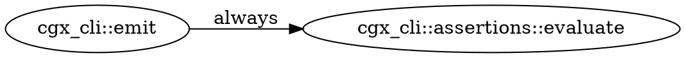
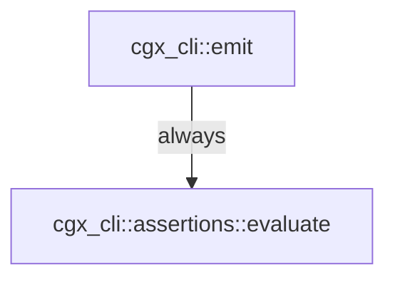

# cgx — Output Formats and Exit Codes

**Audience:** Engineers and AI agents running cgx in interactive or CI contexts.
**Since:** All content v0.1 unless tagged otherwise.

Run `cgx --version` before using this reference. A feature tagged `Since: v0.N` requires `MINOR ≥ N`
in the reported version. For the full version ladder, see `reference/versions.md`.
For flag syntax and subcommand signatures, see `reference/cli.md`.

---

## 1. Output formats (`--format`)

Every subcommand accepts `--format <FMT>`. The default is `human`.

| Format | Since | Best for |
|--------|-------|----------|
| `human` | v0.1 | Reading at a terminal. `callers`/`callees`/`reaches <from>` render an ASCII call **forest** (see §1.1); `paths`/`unused` render a list. File:line evidence and edge/confidence tags inline. |
| `json` | v0.1 | Scripting, agents, CI pipelines. Structured envelope with `count` and `results[]`. |
| `sarif` | v0.1 | Security tooling. SARIF 2.1.0 — uploads to GitHub Advanced Security, VS Code SARIF viewer, and any OASIS-compliant tool. |
| `dot` | v0.1 | Path-shaped results only. Feeds `dot -Tsvg` or any Graphviz consumer for SVG/PNG artifacts. Use for large graphs (Mermaid has a node limit). |
| `mermaid` | v0.1 | Path-shaped results only. Renders inline in GitHub Markdown, Notion, and most docs platforms. Human-writeable and diff-friendly. |
| `d2` | v0.1 | Path-shaped results only. Feeds the D2 diagramming tool or https://play.d2lang.com. |

**Path-shaped restriction:** `dot`, `mermaid`, and `d2` are only meaningful for output that describes a
graph path — the `reaches` and `paths` subcommands, or a `cgx query` that uses `RETURN path`. Applying
them to flat-list results (e.g., `callers`, `unused`) produces degenerate or empty graphs.

### 1.1 The human call forest (`callers` / `callees` / `reaches <from>`)

The default human view of the neighbor-set commands is an ASCII forest: the
queried symbol is the bare root line and the symbols it calls (or that call it)
hang off `├─ │ └─` box-drawing prefixes. Depth is shown by indentation — there is
no `depth=` field.

Each child line is `fqn  file:line`, then non-default tags only:

- condition: `[if]` (conditional), `[exc]` (exception), `loop`/`panic` verbatim;
  `always` is omitted.
- confidence: `[probable]`, `[possible]`; `certain` is omitted.

`--tree <full|spanning>` (default `full`). Both modes bound the walk to depth 3
when `--max-depth` is unset (an explicit `--max-depth` overrides), and a
work-budget cap prints `… (truncated: N more)` at the cut:

- **full** — expand every call edge; a symbol reached from two callers appears
  under each. Revisiting an ancestor on the current branch prints
  `↺ name (cycle)` and stops descending.
- **spanning** — render each symbol once under its shortest-path parent, annotated
  `(+N call sites)` when more than one call site within the bounded neighborhood
  reaches it.

```
cgx_core::confidence::Confidence::weakest  crates/cgx-core/src/confidence.rs:40
├─ cgx_query::engine::build_path_result::{closure@205:14}  …/engine.rs:205  [if]  [probable]
│  └─ ts_sample::closures::nestedClosures::outer  …/closures.ts:58  [possible]  (+1 call sites)
└─ cgx_query::engine::weakest_confidence_to  …/engine.rs:78  [loop]  [probable]
   └─ cgx_query::engine::neighbor_walk  …/engine.rs:36
```

`reaches <from> <to>` (with a target) answers a single reachability question and
keeps its **witness-path** rendering — it is not a forest.

**When to choose which format:**

- Human at a terminal → `human` (default, no flag needed).
- Agent or script consuming results programmatically → `json`.
- CI security gate with GitHub Actions SARIF upload → `sarif`.
- Generating a diagram artifact in CI or embedding in docs → `dot` (CI) or `mermaid` (docs).
- Interactive diagram editing with D2 → `d2`.

### Real output samples

The following samples are from a live run of
`cgx reaches cgx_cli::emit cgx_cli::assertions::evaluate`.

**human:**
```
path 1 (1 hops, min-confidence=probable):
     cgx_cli::emit  (crates/cgx-cli/src/main.rs:647)
  -> cgx_cli::assertions::evaluate  (crates/cgx-cli/src/assertions.rs:57) [always]
```

**json:**
```json
{"count": 1, "results": [{"condition": "always", "confidence": "certain", "depth": 1}]}
```

**dot:**


**mermaid:**


**d2:**
```d2
n0: "cgx_cli::emit"
n1: "cgx_cli::assertions::evaluate"
n0 -> n1: "always"
```

**sarif:** SARIF 2.1.0 JSON with a `runs[].results[]` array. Each result maps to a `physicalLocation`
(file:line) and `logicalLocation` (qualified symbol name). Exit code 1 when `--assert-empty` fires
makes SARIF upload and build failure composable in the same step.

---

## 2. Exit-code contract

| Code | Meaning | How to trigger |
|------|---------|----------------|
| `0` | Success — query ran; results returned (including zero results) | Normal query against an indexed repo |
| `1` | Assert failure — `--assert-empty` fired because results were found | `cgx callers foo --assert-empty` when `foo` has callers |
| `2` | Usage error — unresolved symbol, CQL parse or plan error, bad argument | `cgx callers nonexistent_xyz`; unsupported CQL property; phantom flag |
| `3` | Graph missing or corrupt (only reachable with `--no-auto-index`) | `cgx callers foo --no-auto-index` with no `.cgx/` directory present |
| `4` | Vacuous pass — `--assert-empty` exited 0 but matched zero nodes | `cgx callers nonexistent_xyz --assert-empty` |

**Key insight — exit 0 includes empty results.** A query that finds nothing is not an error. Empty
results exit `0`. Only assertion flags (`--assert-empty`) change that. Exit `2` means the command
itself was malformed (bad symbol name, bad CQL, bad flag) — not that results were absent.

**Auto-index is on by default.** A missing `.cgx/` triggers an automatic build. Exit `3` is only
reachable when `--no-auto-index` is passed explicitly.

**Exit 2 disambiguation.** All three of these produce exit 2:
- Unknown or mistyped symbol name: `no symbol matched pattern '<x>'`
- CQL parse error (e.g., single-quoted string, `NOT IN [...]`, node-only MATCH with no relationship)
- CQL plan error (e.g., deferred node property such as `entrypoint_class`)
- Phantom flag that does not exist (e.g., `--depth`, `--base`, `--avoiding`)

Exit 2 is the signal to check the symbol name (grep source first), the CQL syntax, and the flag
names against `reference/cli.md`. It is never "empty results."

---

## 3. CI assertion mode

### `--assert-empty`

Turns a query into a boolean CI gate. Exit `1` if any results are returned; exit `0` if results are
empty. Output is still written regardless of the assertion outcome — use `--format sarif` to compose
with SARIF upload.

```bash
# Since: v0.1
# Fail CI if any call path from cgx_cli::emit reaches cgx_cli::assertions::evaluate
cgx reaches cgx_cli::emit cgx_cli::assertions::evaluate --assert-empty
```

```bash
# Since: v0.1
# Emit a SARIF report AND fail CI if the path exists
cgx paths FromFn ToFn --assert-empty --format sarif > findings.sarif
```

### `--assert-count` and `--assert-max` (Since: v0.3)

`--assert-count N` exits `1` if the result count does not equal N.
`--assert-max N` exits `1` if the result count exceeds N.

These flags are not available in v0.1.

### Vacuity guard and `--allow-vacuous`

**The problem.** `--assert-empty` can pass vacuously: if the symbol pattern resolves to zero nodes,
no paths are found and the assertion trivially passes — but for the wrong reason. A gate that passes
because the symbol was mistyped (exit `0`) is indistinguishable from a gate that passes because no
paths exist (also exit `0`) without the vacuity guard.

**The guard.** When `--assert-empty` would exit `0` but zero nodes were matched by the query pattern,
cgx exits `4` instead ("assertion vacuously satisfied"). This prevents a mistyped symbol from silently
passing a security gate.

```bash
# Since: v0.1
# If 'nonexistent_xyz' is not in the index, this exits 4 (not 0)
cgx callers nonexistent_xyz --assert-empty
```

**Suppressing the guard.** Pass `--allow-vacuous` to treat a vacuous pass as success (exit `0`).
A stderr warning is emitted regardless. Use this only when an empty symbol set is genuinely expected
(e.g., a new codebase with no callers yet).

```bash
# Since: v0.1
cgx callers new_symbol --assert-empty --allow-vacuous
```

### Writing a correct CI gate

A gate that neither fails on regression nor passes vacuously requires two things:

1. The symbol name resolves in the index (exit `2` if not; exit `4` if vacuous).
2. The gate exits `1` on regression and `0` only on genuine absence.

```bash
# Since: v0.1
# Reliable pattern: verify the symbol exists first, then assert
cgx explain FromFn --repo /path/to/repo          # exits 2 if symbol missing
cgx paths FromFn ToFn --assert-empty \
    --format sarif > findings.sarif               # exits 1 on regression, 4 on vacuous pass
```

In CI, treat exit `4` the same as exit `1` (gate failure) — it signals a misconfigured assertion.
Only exit `0` (genuine empty result) is a clean pass.

```yaml
# GitHub Actions example (Since: v0.1)
- name: Security regression gate
  run: |
    cgx paths FromFn ToFn --assert-empty --format sarif > findings.sarif
  # exit 1 → step fails (regression); exit 4 → step fails (vacuous); exit 0 → passes

- name: Upload SARIF
  if: always()
  uses: github/codeql-action/upload-sarif@v3
  with:
    sarif_file: findings.sarif
```

---

## Cross-references

- Flag syntax and per-subcommand flag availability: `reference/cli.md`
- Version ladder and capability `since` tags: `reference/versions.md`
- Edge-condition labels and confidence ladder (needed to interpret result fields): `reference/mental-model.md`
- CQL syntax constraints that produce exit 2: `reference/query-language.md`
